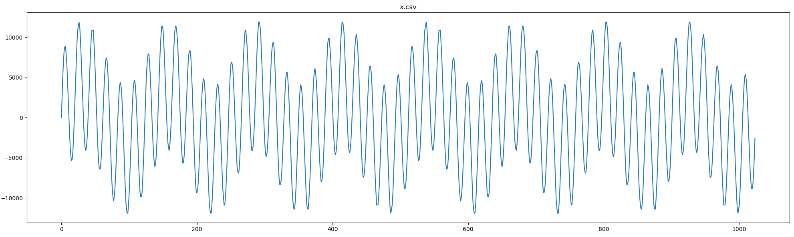
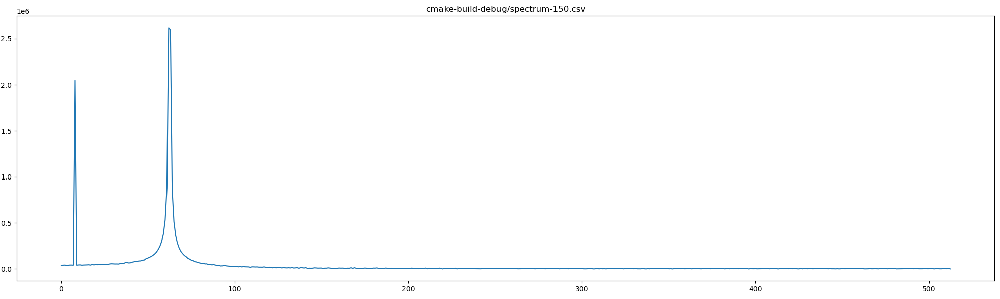
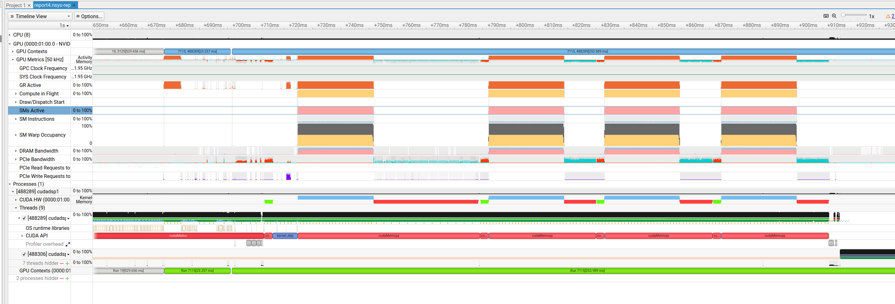

# CUDA project: `cudadsp1`

## Overview

`cudadsp1` aims to demonstrate parallel dsp processing of audio packets using CUDA.
A large number of test RTP packets containing g.711 encoded payloads are sent in batches to the device, decoded 
and transformed by fft and other operations, and sent back to the host CPU in near real-time.
The project can be used to explore GPU occupancy strategies and tuning. 

### features / operation

- host allocates host+device packet buffers, generate ~ 20K `rtp_packet` packets with test audio content
- loop for timing:
  - send packets to device
  - invoke kernel: 1 packet per block, _n_ threads/block
  - transfer results back to host

Inside the kernel:
- input buffer split into packet for each block to work on
- decode samples
- real-to-complex CuFFTDx execution
- repeat in loop for performance testing

## results

Thus far, simulating a dsp load by having the kernel do 25 loops of decode & FFT steps, we can process ~ 20K channels
in less than 40ms with an RTX 2080 card.  Nvidia Nsight sys/compute are indicating that warp occupancy is at 50%, so
there's room for improvement.

There are 20K packets created.  Sample payload and spectrum results can be found in `run/` directory.  That data corresponds to the following graphs:




Profile with 4 runs:



### next:
- setup new streams so memory transfers can happen in parallel with computation
- investigate low occupancy and other recommendations from Nsight


## Project Structure

`src/` project source code

`~/nvidia-mathdx-25.01.1/` installation for CuFFTDx

`README.md` this file

`plt.ps` use for testing, plotting results

## Prerequisites

To build and run the `cudadsp1` project, the following are required:

- SM 7.0+
- x86_64, developed & tested on Linux
- [CuFFTDx](https://docs.nvidia.com/cuda/cufftdx/index.html)
- CUDA toolkit 12.5+ 
- CMake 3.1+, C++20

## Building the Project

1. Clone the project repository to your local system.
2. Navigate to the project directory.
3. update CMakeLists.txt with reference to CuFFTDx installation directory
4. Build using CMake:
   ```bash
   mkdir build
   cd build
   cmake ..
   make
   ```
## running
command line arg (optional): provide the number of host memcpy/kernel iterations to do in main loop (defaults to 4).
```bash
$./cudadsp1 4

num packets 20000
fft input_length 1024
fft output_length 513
block size 32, elements per thread 32
per-SM shared memory size 4 KB
hostToDevice copy 19 MB
deviceToHost copy 78 MB

iterations: 4
total time: 196 ms (49.0 ms per iteration, 2.4 μs per packet)
```
